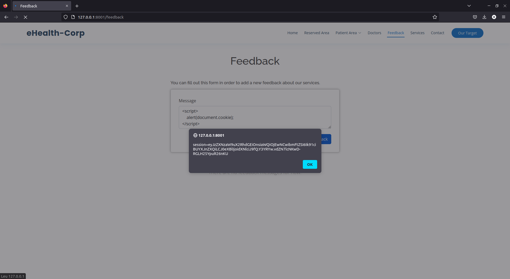
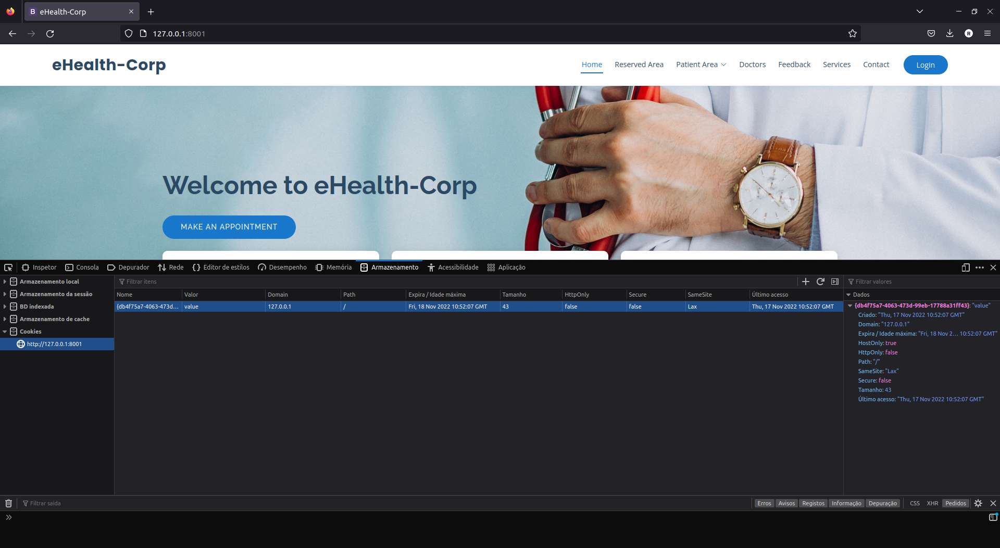
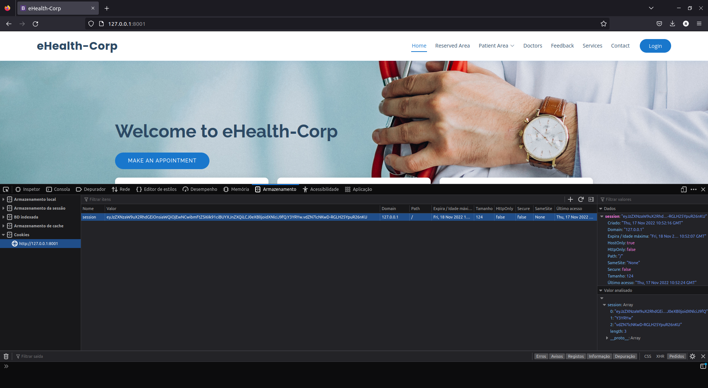

## CWE-1004: Sensitive Cookie Without 'HttpOnly' Flag
- https://cwe.mitre.org/data/definitions/862.html

**Ver descrição, score e solução no [report.md](../report.md#cwe-1004-sensitive-cookie-without-httponly-flag).**

---

# Exploração da vulnerabilidade
A exploração desta vulnerabilidade assenta na replicação do exemplo já apresentado na vulnerabilidade [CWE-79 XSS](CWE-79.md), tendo-se alterado apenas o método executado pelo atacante.

## Ataque: obter cookies de sessão de um utilizador
### Passo 1
Aceder à página dos feedbacks e inserir o seguinte excerto de HTML:
```html
<script>
    alert(document.cookie);
</script>
```



### Passo 2
Submeter o feedback.

### Resultado intermédio
Sempre que um utilizador aceder à página dos feedbacks, o seu cookie de sessão será mostrado numa *alert box*.

Num ataque real, o cookie de sessão poderia ser enviado para um outro servidor, controlado pelo atacante.

### Passo 3
Clicar no '+' da secção 'Armazenamento > Cookies' dos *DevTools* do navegador, para adicionar um novo cookie.



### Passo 4
Preencher o campo 'Nome' com 'session' e o campo 'Valor' com o cookie de sessão obtido no passo 2.



### Passo 5
Atualizar a página.

### Resultado
O atacante está *logged in* com a conta do utilizador.


