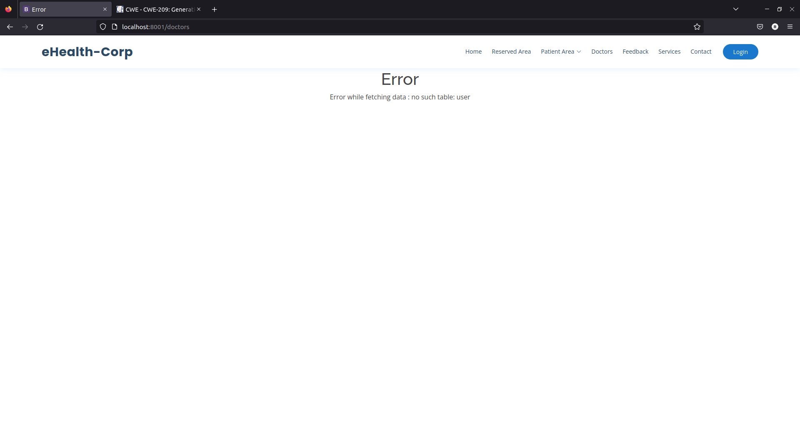

## CWE-209: Generation of Error Message Containing Sensitive Information
- https://cwe.mitre.org/data/definitions/209.html

**Ver descrição, score e solução no [report.md](../report.md#cwe-209-generation-of-error-message-containing-sensitive-information).**

---
# Exploração da vulnerabilidade
## Ataque: saber se uma tabela existe

### Passo 1
Aceder à página *Doctors* e inserir no campo de pesquisa o seguinte excerto de código SQL:
```sql
1' AND 1=2 UNION SELECT * FROM user -- //
```
>**Nota**: O nome da tabela é ```app_user```. Contudo, um atacante começaria por tentar nomes de tabelas mais comuns (por exemplo, ```user```).

### Passo 2
Submeter o formulário de pesquisa.

### Resultado
É embutida uma mensagem de erro no HTML da página.



Por tentativa e erro, o atacante consegue descobrir nomes de tabelas/colunas e até inferir o SGBD utilizado (MySQL, SQLite, etc.), pela sintaxe das *queries*.
