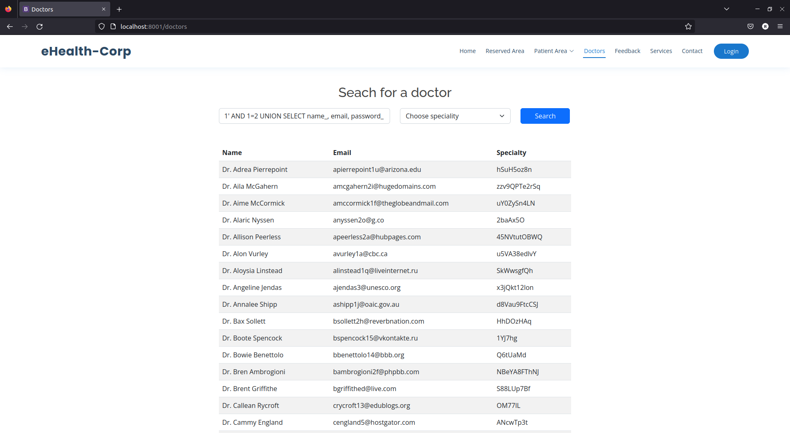

## CWE-257: Storing Passwords in a Recoverable Format
- https://cwe.mitre.org/data/definitions/257.html

**Ver descrição, score e solução no [report.md](../report.md#cwe-257-storing-passwords-in-a-recoverable-format).**

---
## Exploração da vulnerabilidade
Esta vulnerabilidade pode ser explorada, tendo por base outras como, por exemplo, a do SQL Injection [CWE-89](CWE-89.md).

### Ataque: obter a password de qualquer utilizador
Ver ["Ataque: visualizar a tabela com utilizadores/doutores, desconhecendo o nome da mesma"](CWE-89.md#ataque-visualizar-a-tabela-com-utilizadoresdoutores-desconhecendo-o-nome-da-mesma).

