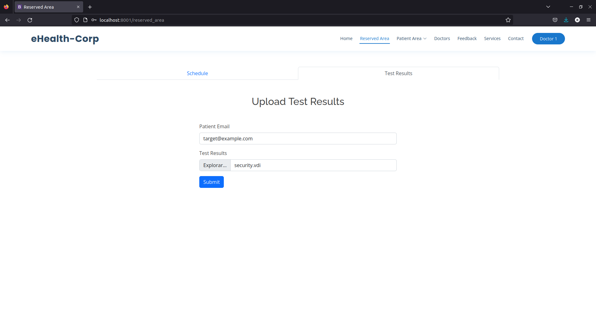
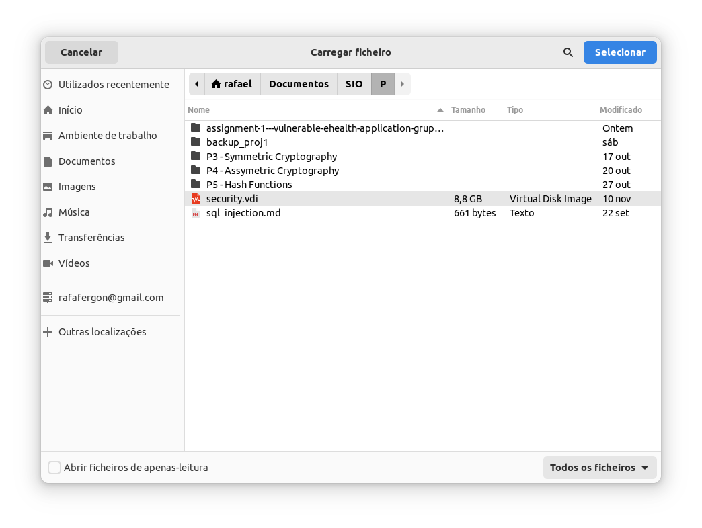

## CWE-400: Uncontrolled Resource Consumption ('Resource Exhaustion')
- https://cwe.mitre.org/data/definitions/400.html

**Ver descrição, score e solução no [report.md](../report.md#cwe-400-uncontrolled-resource-consumption-resource-exhaustion).**

## Exploração da vulnerabilidade

Para esse efeito, basta ao utilizador enviar um ficheiro muito grande.

