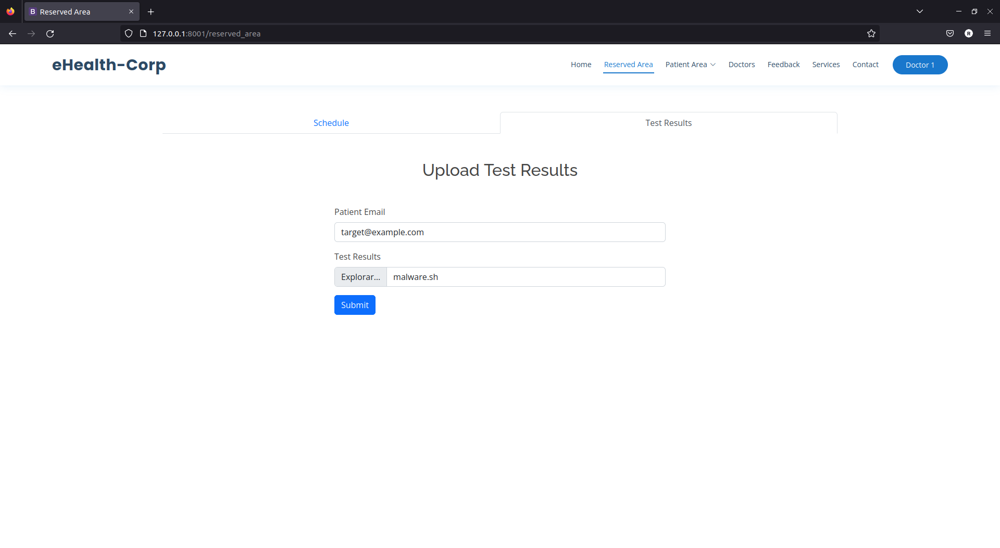
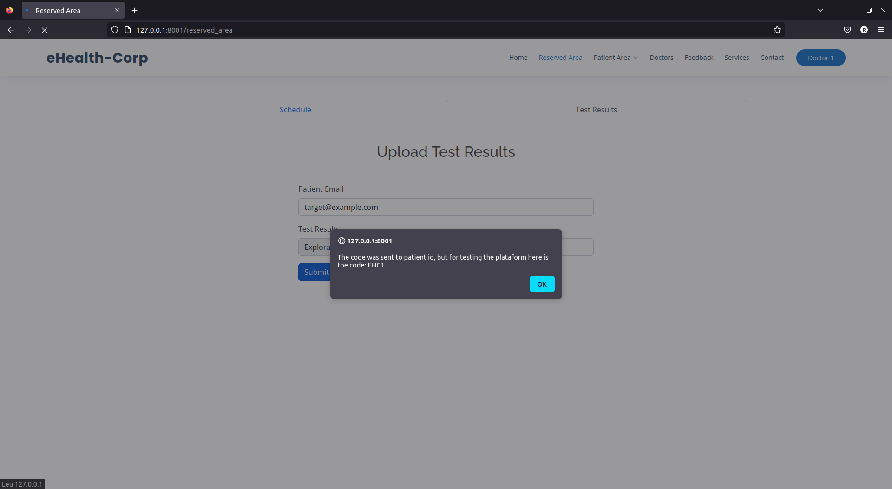
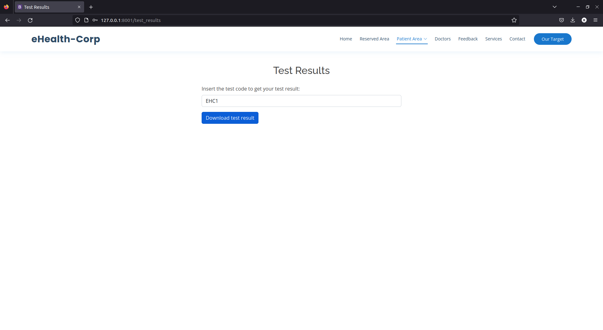
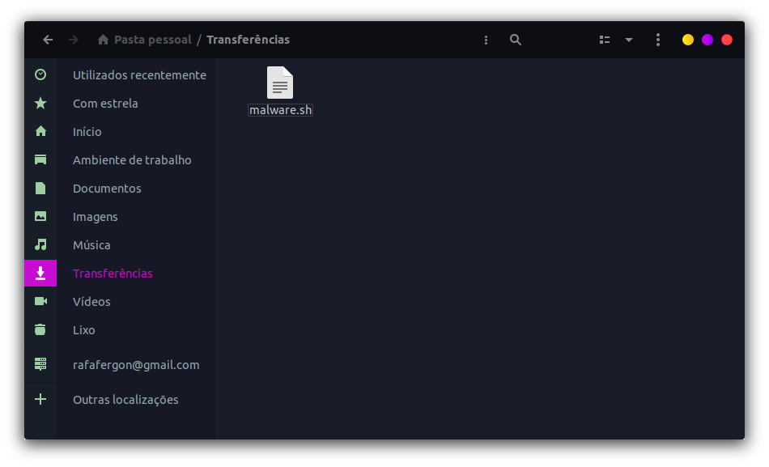

## CWE-434: Unrestricted Upload of File with Dangerous Type
- https://cwe.mitre.org/data/definitions/434.html

**Ver descrição, score e solução no [report.md](../report.md#cwe-434-unrestricted-upload-of-file-with-dangerous-type).**

---

## Exploração da vulnerabilidade

Uma forma simples de explorar esta vulnerabilidade é submeter um ficheiro malicioso como resultado de um teste. Assim, quando o utilizador o descarregar, caso não esteja munido com um antivírus, verá a segurança da sua máquina comprometida.

