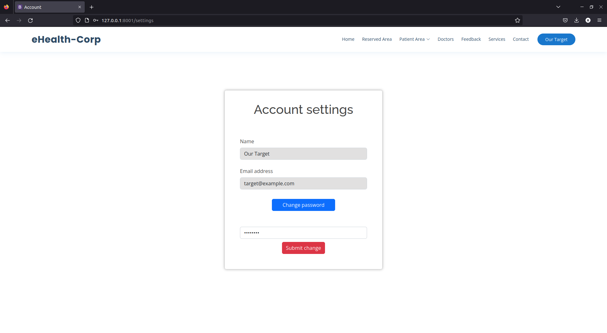

## CWE-620: Unverified Password Change
- https://cwe.mitre.org/data/definitions/620.html

**Ver descrição, score e solução no [report.md](../report.md#cwe-620-unverified-password-change).**

---
## Exploração da vulnerabilidade

A exploração desta vulnerabilidade passa simplesmente por alterar a password nas definições de conta, não havendo a necessidade de apresentar a original.

Isto pode envolver exploração de outras vulnerabilidades já apresentadas, como [SQL Injection](CWE-89.md) e [XSS](CWE-79.md), para obter acesso às credenciais ou à sessão de um utilizador.

Explorar esta vulnerabilidade pode significar a alteração da password de utilizadores com privilégios de administração da aplicação, o que compromete fortemente a sua segurança e integridade.

