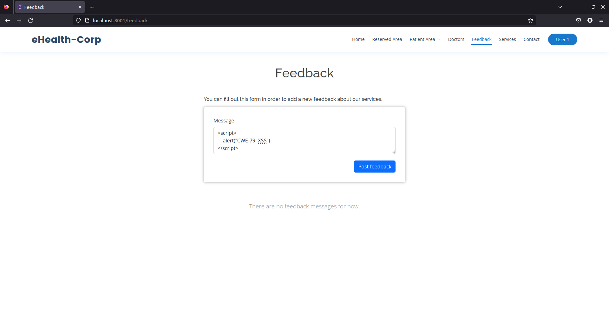
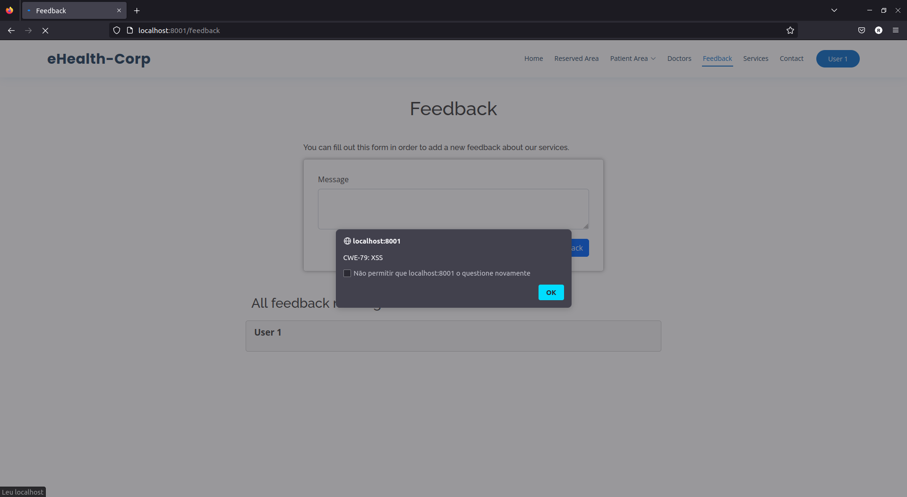

## CWE-79: Improper Neutralization of Input During Web Page Generation ('Cross-site Scripting')
- https://cwe.mitre.org/data/definitions/79.html

**Ver descrição, score e solução no [report.md](../report.md#cwe-79-improper-neutralization-of-input-during-web-page-generation-cross-site-scripting).**

---
# Exploração da vulnerabilidade
Para esse efeito, basta inserir um excerto de HTML, na mensagem de feedback.

### Negação de serviço
**Código exemplo**:
```html
<script>
    window.location.href = "[RANDOM_URL]";
</script>
```

Com este ataque, o serviço a que o utilizador está a tentar aceder (*Feedback*) deixa de estar disponível.

**Redirecionamento para um URL externo**:

```RANDOM_URL = "[EXTERNAL_URL]"```

Este URL pode ser malicioso.

**Redirecionamento para um URL interno (*loop*)**:

```RANDOM_URL = "http://localhost:[PORT]/feedback"```

Se vários utilizadores acederem à página, o servidor pode ficar sobrecarregado, pois vai atender, em simultâneo, a infinitos pedidos para o mesmo URL.

### Roubos de sessão
Também é possível realizar outro tipo de ataques como, por exemplo, roubar cookies de sessão. Abordámos esse tópico na análise da vulnerabilidade [CWE-1004](CWE-1004.md).

## Ataque: injetar um script na página *Feedback*
### Passo 1
Aceder à página dos feedbacks e inserir código JavaScript delimitado pelas tags ```<script>``` e ```</script>```.

### Passo 2
Submeter o feedback.



### Resultado
O código JavaScript é executado. No exemplo, é apresentado um *alert* com o conteúdo "CWE-79 XSS".

