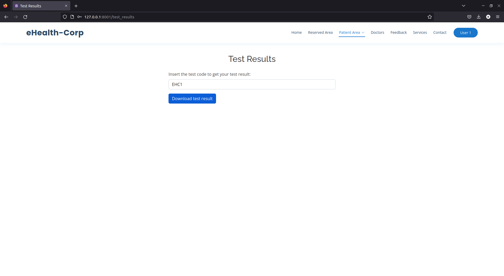

## CWE-862: Missing Authorization
- https://cwe.mitre.org/data/definitions/862.html

**Ver descrição, score e solução no [report.md](../report.md#cwe-862-missing-authorization).**

---
## Exploração da vulnerabilidade
Para isso, basta ao utilizador saber a estrutura dos códigos dos testes (no caso, começam por "EHC") e fazer tentativas de acesso aos mesmos.

## Ataque: acesso a um teste
O ["Ataque: submeter um ficheiro malicioso como resultado de um teste"](CWE-434.md#ataque-submeter-um-ficheiro-malicioso-como-resultado-de-um-teste) comprova que é possível aceder a um teste sem estar autenticado.

